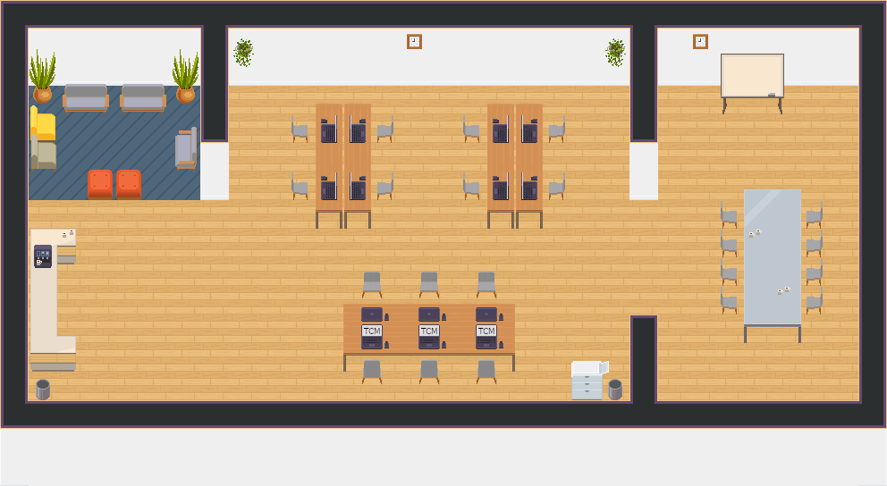

# WorkAdventure Map Starter Kit

This is a starter kit to help you build your own map for [WorkAdventure](https://workadventu.re).

To understand how to use this starter kit, follow the tutorial at [https://workadventu.re/map-building](https://workadventu.re/map-building).



## Installation

With npm installed (comes with [node](https://nodejs.org/en/)), run the following commands into a terminal in the root directory of this project:

```shell
npm install
npm run start
```

The project will run at http://localhost:8080/

## Licenses

This project contains multiple licenses:

* [Code license](./LICENSE.code) *(all files except those for other licenses)*
* [Map license](./LICENSE.map) *(`map.json` and the map visual as well)*
* [Assets license](./LICENSE.assets) *(the files inside the `src/assets/` folder)*

### About third party assets

If you add third party assets in your map, do not forget to:
1. Credit the author and license with the "tilesetCopyright" property present in the properties of each tilesets in the `map.json` file
2. Add the license text in LICENSE.assets


### lic
1. https://www.deviantart.com/chaoticcherrycake/art/Pokemon-Tileset-From-Public-Tiles-32x32-623246343
2. https://www.deviantart.com/chimcharsfireworkd/art/BW-Citrine-Tileset-Resized-227350418
3. https://www.deviantart.com/phyromatical/art/DoT-Day24-Evolina-Mountains-Full-Set-653153011
4. https://www.deviantart.com/ayene-chan/art/RPG-Maker-VX-Ace-Sofas-and-Armchairs-466764664
5. https://www.deviantart.com/ayene-chan/art/RPG-Maker-VX-Flowers-and-Pots-458076623
6. https://www.deviantart.com/magiscarf/art/Old-River-Bridge-705696000
7. https://www.deviantart.com/phyromatical/art/Taragonia-BW-Mix-434036293
8. IDEAS:
9. https://www.deviantart.com/princess-phoenix/art/Fossil-Museum-Tileset-780178878
10. https://www.deviantart.com/phyromatical/art/It-s-just-Halloween-643280897
11. https://www.deviantart.com/alucus/art/Cielo-Town-Remade-616729023
